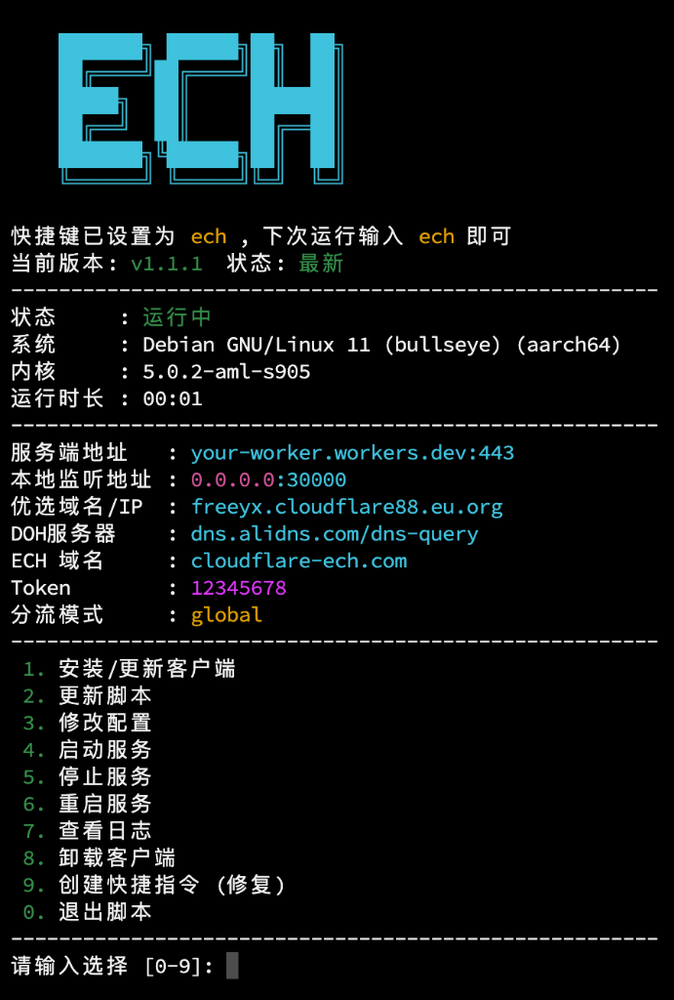

# ECH Workers Client CLI Tool

[](https://opensource.org/licenses/MIT)

> ⚠️ **说明 / Note**  
> 本项目是基于 [byJoey/ech-wk](https://github.com/byJoey/ech-wk) 开发的第三方管理脚本。  
> 核心代理程序文件 (`ech-workers`) 直接来源于原作者的 Release 发布页。  
> 感谢原作者 @byJoey 以及底层核心开发 [CF_NAT](https://t.me/CF_NAT)！
---

这是一个专为 Debian / Ubuntu / Armbian / CentOS 等 Linux 系统设计的 **ECH Workers Client** 命令行管理工具 (CLI)。

旨在为 Linux 用户（尤其是无头服务器/软路由用户）提供最便捷的安装和管理体验。



## ✨ 主要特性

*   **⚡️ 一键安装**: 自动检测系统架构 (amd64/arm64)，自动下载最新内核。
*   **🇨🇳 国内加速**: 智能检测网络环境，国内用户自动使用 `gh-proxy` 镜像加速下载。
*   **🔄 自动更新**: 脚本支持版本检测与一键自我更新，保持功能最新。
*   **🖥️ 交互界面**: 提供全中文的图形化菜单 (TUI)，操作简单直观。
*   **📊 连接统计**: 日志界面集成实时连接数统计与 **IP 归属地查询**功能。
*   **🤖 自动配置**: 引导式配置向导，支持快速设置优选 IP、Token、DOH 等关键参数。
*   **⚙️ 服务管理**: 自动创建 Systemd 服务，支持开机自启、后台静默运行、异常自动重启。
*   **⌨️ 快捷指令**: 自动注册 `ech` 全局命令，随时随地管理服务。

## 🚀 快速开始

在您的 Linux 终端中执行以下命令即可安装：

```bash
# 方法一：在线下载脚本
wget -O ech-cli.sh https://raw.githubusercontent.com/lzban8/ech-cli-tool/main/ech-cli.sh

# 方法二：手动上传
# 您也可以先下载 ech-cli.sh 到本地，然后上传到服务器 (如 /root 目录)

# 授信运行
chmod +x ech-cli.sh
./ech-cli.sh
```


## 🎮 使用指南

安装完成后，直接在终端输入 `ech` 即可进入管理面板：

```bash
root@armbian:~# ech
```

### 功能菜单

1.  **安装 / 更新客户端**: 保持核心代理程序 (`ech-workers`) 为最新版本。
2.  **更新脚本**: 一键检测并更新此管理脚本 (`ech-cli.sh`) 到 GitHub 最新版。
3.  **修改配置**: 调整服务端地址、分流模式、优选IP等参数。
4.  **服务管理**: 包含启动、停止、重启服务。
5.  **查看日志**: 显示在线人数、客户端 IP 归属地，并查看实时运行日志。
6.  **卸载客户端**: 彻底清理所有文件和服务。

## 📝 高级配置

配置文件位于 `/etc/ech-workers.conf`，支持手动修改：

```env
SERVER_ADDR="your-worker.workers.dev:443"  # Cloudflare Worker 地址
LISTEN_ADDR="0.0.0.0:30000"                # 本地监听地址
TOKEN="your-token"                         # 认证 Token
BEST_IP="freeyx.cloudflare88.eu.org"       # 优选 IP 或域名
DNS="dns.alidns.com/dns-query"             # DoH 服务器
ECH_DOMAIN="cloudflare-ech.com"            # ECH 配置域名
ROUTING="bypass_cn"                        # 分流模式: bypass_cn / global / none
```

## 🤝 贡献与致谢

*   核心程序: [byJoey/ech-wk](https://github.com/byJoey/ech-wk)
*   核心原创: [CF_NAT](https://t.me/CF_NAT)
*   脚本维护: lzban8

欢迎提交 Issue 或 Pull Request 来改进此脚本！ 
